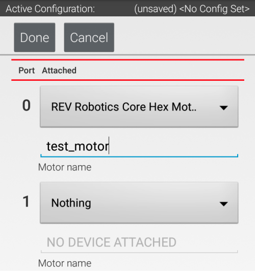

# The HardwareMap

<p>So, we've created our OpMode, but now we want to have access to our hardware, and be able to control our robots mechanisms.</p>
<p>To gain access to our hardware, we need to use the HardwareMap

## What is the HardwareMap?



<p>The hardware map is the place on the Robot Controller where all the Hardware is defined for the Control/Expansion Hub. Inside of the hardware map, you define what hardware is connected to each port on the hub, along with a name for the program to be able to access.</p>
<p>You can edit the hardware map by going to your Driver Controller, pressing the three dots in the top right corner, and selecting configure.</p>

## Getting access to Hardware

<p>To get access to our hardware, we first need an object that can interface with our hardware.</p>

```
DcMotor testMotor;
```

<p>Now that we've created a motor object, we need to link the object we created to the hardware using the hardware map</p>

```
public void runOpMode() throws InterruptedException{

    testMotor = hardwareMap.get(DcMotor.class, "testMotor");

    waitForStart();
}
```

<p>What we see here is a basic use of the hardware map. We have our motor object, and we need to set it equal to the actual motor defined in the hardware map itself.</p>
<p>To use the hardware map, we have to use the hardwareMap object. The hardwareMap object has a method called "get" which asks for what object class we're looking for along with the name of the motor we defined in the Hardware Map.</p>
<p>This hardwareMap.get() method will return DcMotor object that will allow us to control the physical motor through the "testMotor" object.</p>
<p>This process works for all objects in the hardwareMap.</p>